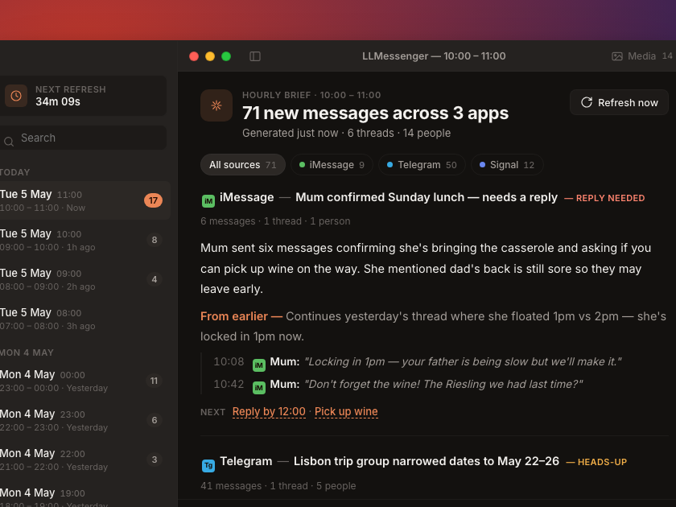
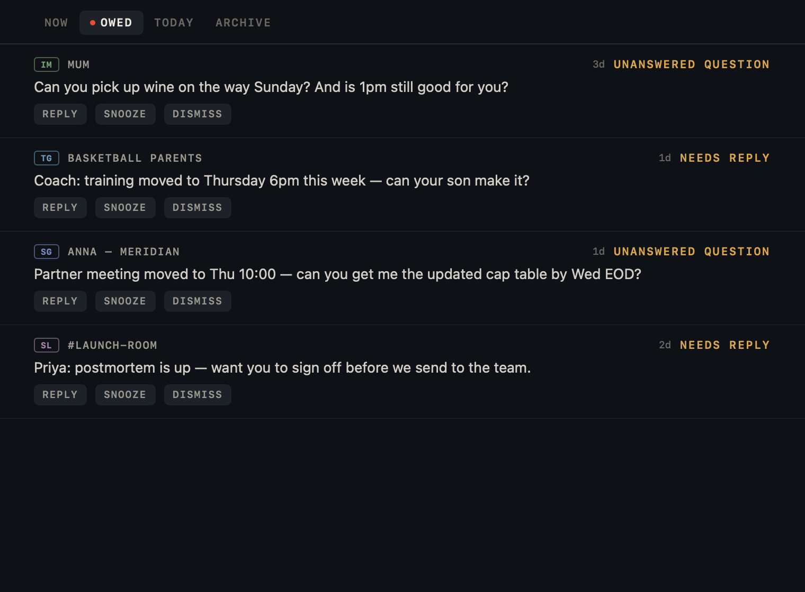
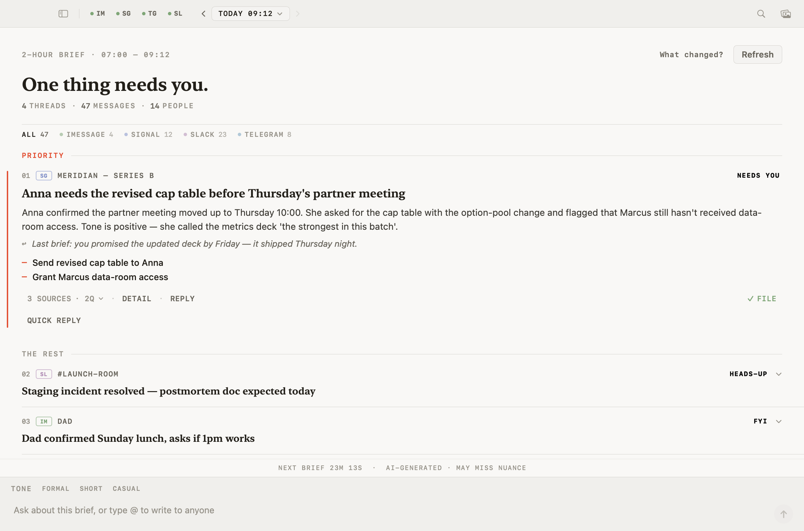

<div align="center">

# LLMessenger

**Stop reading 200 messages. Read one brief — and never drop someone who matters.**

LLMessenger is a notification firewall for your Mac. It reads iMessage, Signal, Telegram, and Slack so you don't have to — silences the noise, interrupts you only when someone actually needs you, turns everything else into a brief you read in 30 seconds, and keeps a running list of the people still waiting on your reply.

Free. Open source. On-device AI. Your messages never have to leave your Mac.

[](https://github.com/googlarz/LLMessenger/actions/workflows/ci.yml)
[](https://github.com/googlarz/LLMessenger/releases/latest)
[](LICENSE)
[](https://github.com/googlarz/LLMessenger/releases/latest)
[](project.yml)

[**Download**](https://github.com/googlarz/LLMessenger/releases/latest) · [Quick start](#quick-start) · [Owed Replies](#never-drop-someone-who-matters) · [How it works](#how-it-works) · [Privacy](#privacy) · [FAQ](#faq)



</div>

---

## Why

You are in five group chats, two Slack workspaces, and a family iMessage thread. Most of those messages don't need you. A few really do — and they're buried.

Every messaging app solves this by sending you *more* notifications. LLMessenger does the opposite:

> 🔕 **Routine chatter is held back silently.**
> 🔔 **You get one notification — when someone needs your reply.**
> ☕ **Everything else lands in your Morning Digest.**

It looks like this:

> **iMessage** — *Mum confirmed Sunday lunch — needs a reply* · `REPLY NEEDED`
> Mum sent six messages confirming she's bringing the casserole and asking if you can pick up wine.
> **NEXT** → Reply by 12:00 · Pick up wine

> **Slack** — *#eng-pricing settled on the new tier structure* · `INFO`
> The team converged on three tiers after a 90-message debate. Engineering scoped it to two sprints.
> **NEXT** → Acknowledge the proposal in #eng-pricing

Click any card to ask follow-up questions ("who confirmed attendance?"), tap a style-matched quick reply, or have the AI draft a response you review before sending.

## Never drop someone who matters

The firewall protects you from what's coming *in*. **Owed Replies** protects the relationships going *out* — it surfaces the people still waiting on you, ranked by who counts, so a question from Mum or your kid's coach never gets buried under work chatter.



It learns who matters from your own behavior, or you can just tell it: *"this is my son's basketball team — the coach posts about training and games, flag those, ignore the rest."* That per-conversation **context** then sharpens every triage decision and every brief. Conversations you mark private are never sent to a cloud model.

<details>
<summary>Light mode, too (follows your system, or set it manually)</summary>



</details>

## Quick start

**60 seconds, one permission, no account, no API key.**

1. **[Download the latest release](https://github.com/googlarz/LLMessenger/releases/latest)**, unzip, move to Applications.
   > The binary is unsigned — right-click → **Open** → **Open** on first launch (or System Settings → Privacy & Security → **Open Anyway**).
2. **Grant Full Disk Access** when the wizard asks — this lets it read your iMessage history. The screen detects the grant live; no restart needed.
3. **That's it.** On macOS 26 with Apple Intelligence, the AI runs on-device automatically — zero configuration. Click the envelope in your menu bar → **New Brief**.

Signal, Telegram, and Slack are optional and can be added any time in Settings.

<details>
<summary><strong>Build from source instead</strong></summary>

```bash
git clone https://github.com/googlarz/LLMessenger
cd LLMessenger
brew install xcodegen
xcodegen generate
open LLMessenger.xcodeproj   # ⌘R in Xcode 15+
```

CI builds and runs all 430 tests on every push. The [release workflow](.github/workflows/release.yml) builds an unsigned `.app` from any tag on a clean runner and publishes a SHA-256 of the binary, so you can verify a downloaded build matches the source.

</details>

## Choose your AI

| Backend | Setup | Cost | Privacy |
|---|---|---|---|
| **On-Device** (Apple Intelligence) | None — auto-selected | Free | Nothing leaves your Mac · macOS 26+ |
| **Ollama** | `brew install ollama && ollama pull llama3.1` | Free | Nothing leaves your Mac · macOS 13+ |
| **Anthropic Claude** | API key | Pay per use | Opt-in cloud — best brief quality |
| **OpenAI** | API key | Pay per use | Opt-in cloud |

Cloud backends are strictly opt-in. **Local-only mode** (Settings → Privacy) is a single toggle that guarantees no message content can leave your machine.

## What it does

**Attention protection**
- **Notification firewall** (on by default) — routine briefs generate silently; only `REPLY NEEDED` breaks through. Held-back count surfaces in your next digest.
- **Owed Replies** — a running, ranked list of people still waiting on your reply, so nothing important slips. Reply in place, snooze, or dismiss.
- **Morning Digest** — one scheduled daily brief with everything the firewall held back, ordered by who matters to you.
- **Notification Center widget** — latest headline + priority counts at a glance (macOS 14+).

**Understands who matters**
- **Per-conversation context** — tell it (or let it learn) who's a key sender, what's important, and what's noise; it sharpens every triage and brief. Teach it in plain language or accept its suggestions.
- **Learned suggestions** — "you always reply to Coach fast — prioritize him here?" from your own behavior, never nagging.
- **Per-conversation privacy** — mark a conversation local-only (never touches the cloud) or never-draft. The relationship model stays entirely on your Mac.

**Briefs**
- Unified inbox: iMessage, Signal, Telegram, Slack (multi-workspace).
- Structured cards: headline, prose summary, action items, key quotes, priority.
- **Source-grounded** — every card cites exact message IDs; quotes are validated against real messages. No hallucinated summaries.
- Conversation memory: rolling per-conversation summaries and unresolved actions carry across brief cycles, and older briefs compress into episodic context.
- Your own replies are captured as context, so the AI knows when you've already responded.

**Composing**
- Ask questions about any conversation in plain language.
- Quick-reply chips matched to your writing style — they populate the composer, never auto-send.
- `@` mention picker to message anyone on any service from one input.
- AI reply drafts you review, edit, send, or discard.

## How it works

```
                         ┌──────────────────────────────────────────┐
 Menu bar ──► PollEngine ├─► iMessage   ~/Library/Messages/chat.db  │
  (hourly /              ├─► Signal     local signal-mcp daemon     │
   on demand)            ├─► Telegram   bundled adapter binary      │
                         └─► Slack      Web API, multi-workspace    │
                                        │
                                        ▼
                          SQLite (GRDB) — everything stays local
                                        │
                                        ▼
                          BriefEngine ──► your chosen LLM
                          · source-grounded prompts
                          · rolling conversation state
                          · episodic memory compression
                                        │
                                        ▼
                  Brief stored ─► firewall decides: notify or hold
```

Each service is summarized in parallel — one adapter failing never drops the rest. The full adapter contract is a 6-method protocol ([`MessengerAdapter.swift`](LLMessenger/Core/Adapters/MessengerAdapter.swift)); new services are a contribution away.

## Privacy

This is the entire trust model — see [`PRIVACY.md`](PRIVACY.md) for the full data-flow story:

- **There is no LLMessenger server.** Nothing to breach, no developer who can read your messages, no account to create.
- **All data lives in** `~/Library/Application Support/LLMessenger/`. Delete the folder, and it's gone.
- **On-Device or Ollama = zero egress.** With a local backend and no Slack, no message content ever leaves your machine.
- **Network audit log** (Settings → Privacy) shows every cloud HTTPS call live — provider, endpoint, status, bytes. Never message content.
- **Pre-send redaction** (opt-in) strips credit cards, SSNs, IBANs, and emails before anything reaches a cloud LLM.
- **Keys in the Keychain.** API keys and Slack tokens are never written to plain files.
- **No telemetry. No analytics. No auto-update beacon.**

Don't trust the README? The [reproducible release workflow](.github/workflows/release.yml) lets anyone rebuild the binary from source on a clean GitHub runner and compare SHA-256 hashes.

## FAQ

<details>
<summary><strong>Does this send my messages to OpenAI / Anthropic?</strong></summary>

Only if you explicitly choose a cloud backend. The default path (On-Device on macOS 26, Ollama otherwise) processes everything locally. Local-only mode makes cloud egress impossible with one toggle, and the network audit log lets you verify it live.
</details>

<details>
<summary><strong>Why does it need Full Disk Access?</strong></summary>

iMessage history lives in `~/Library/Messages/chat.db`, which macOS protects behind Full Disk Access. LLMessenger reads that database directly — there is no iMessage API. It's the only permission required, and you can see exactly what's done with it in [`iMessageAdapter.swift`](LLMessenger/Core/Adapters/iMessageAdapter.swift).
</details>

<details>
<summary><strong>Will it ever auto-send a message?</strong></summary>

No. Quick replies and AI drafts only populate the composer. Every send is a click you make.
</details>

<details>
<summary><strong>What about WhatsApp?</strong></summary>

On the roadmap, pending a viable local API. The adapter protocol is designed for it — if you know a reliable local WhatsApp bridge, open an issue.
</details>

<details>
<summary><strong>How accurate are the summaries?</strong></summary>

Every card must cite real message IDs and quotes are validated against the actual messages — fabricated quotes are rejected before a brief is stored. Quality depends on the backend; Claude produces the strongest briefs, on-device models the most private ones.
</details>

<details>
<summary><strong>Why is the app unsigned?</strong></summary>

Code signing requires a paid Apple Developer account, and this is a free community project. The reproducible-build workflow is the alternative trust path: verify the binary against the source yourself. Want a notarized build? `make notarize` with your own Developer ID — see [`docs/NOTARIZATION.md`](docs/NOTARIZATION.md).
</details>

## Requirements

- macOS 13 Ventura or later (widget needs 14+, On-Device AI needs 26+ with Apple Intelligence)
- **iMessage** — works out of the box with Full Disk Access
- **Signal** *(optional)* — [signal-mcp](https://github.com/googlarz/signal-mcp) running locally
- **Telegram** *(optional)* — bundled adapter, interactive sign-in from Settings
- **Slack** *(optional)* — your own Slack app's user token, multi-workspace supported

## Contributing

PRs and issues welcome — this project is free and stays free.

The highest-impact contribution is a **new service adapter**: implement the 6-method [`MessengerAdapter`](LLMessenger/Core/Adapters/MessengerAdapter.swift) protocol and your service plugs into polling, briefs, the firewall, and the composer automatically. [`SignalCLIAdapter.swift`](LLMessenger/Core/Adapters/SignalCLIAdapter.swift) is a good reference implementation.

```bash
xcodegen generate                      # project.yml is the source of truth
xcodebuild -scheme LLMessenger test    # 430 tests — keep them green
```

## Roadmap

- [ ] Cross-conversation people memory (link who's who across chats)
- [ ] Email adapter (IMAP read-only — Proton Bridge, Gmail, iCloud)
- [ ] WhatsApp adapter (pending viable local API)

<details>
<summary>Shipped (v1.4 – v2.0)</summary>

**v2.0 "Understand"** — the app learns who matters and protects your relationships:
- ✅ **Owed Replies** — the people waiting on you, ranked by who counts (attention-debt surface)
- ✅ Per-conversation **Context** — tell it (or it learns) what's important and who's signal; drives triage + summaries
- ✅ Learned context suggestions — "prioritize Coach Mike here?" from your own reply behavior
- ✅ Learning loop + per-conversation privacy (`local_only` never touches the cloud; `never_draft`)
- ✅ Per-conversation glossary · context-aware digest ordering

**v1.4 – v1.7:**
- ✅ Notification firewall · Morning Digest · Notification Center widget
- ✅ On-Device AI via Apple Intelligence (macOS 26+)
- ✅ iMessage-first 60-second onboarding
- ✅ Quick Reply — style-matched suggestions (never auto-send)
- ✅ Slack adapter (multi-workspace) · `@` mention picker
- ✅ Local-only mode · network audit log · pre-send redaction
- ✅ Security hardening (prompt-injection defenses, URL validation)
- ✅ Search, pinning, date filters, Demo Mode, Wire Desk redesign
- ✅ Reproducible release builds
- ✅ Real-time notification firewall (FSEvents + 30s poll fallback)
- ✅ Priority rules v2 — quiet hours, behavior-based suggestions
- ✅ "The Desk" — Now / Today / Archive with light mode
- ✅ Adapter plugin API v1 — PLUGIN-API.md + echo reference adapter

</details>

## License

[Apache 2.0](LICENSE) — free for everyone, forever.
