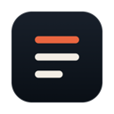
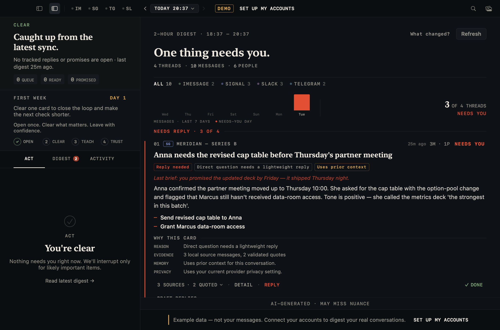
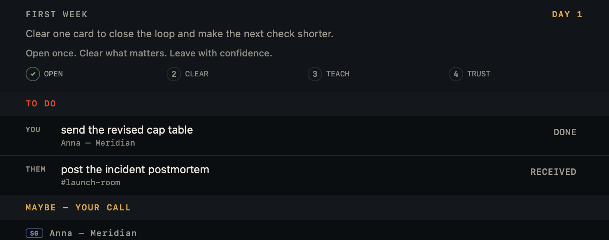
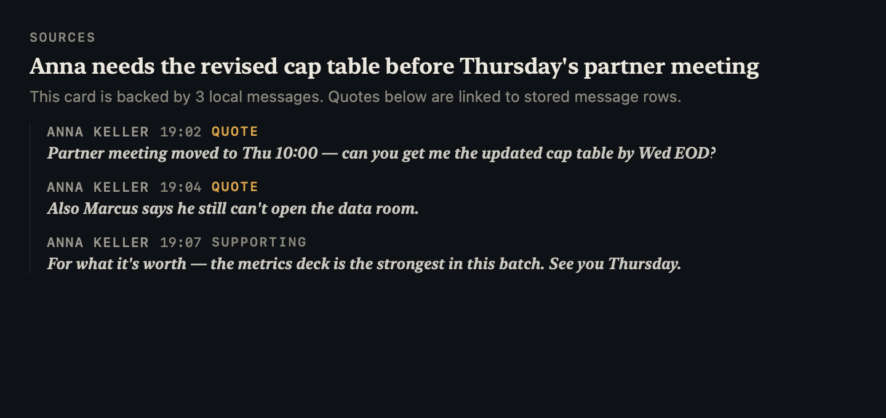

<div align="center">



# LLMessenger

**Stop reading 200 messages. Read one digest — and let an agent handle the rest.**

LLMessenger is a notification firewall *and a communications agent* for your Mac. It reads iMessage, Signal, Telegram, and Slack so you don't have to — silences the noise, interrupts you only when someone actually needs you, turns everything else into a 30-second digest, tracks who's still waiting on you, and **drafts the replies, follow-ups, and RSVPs you'd send — in your voice — and lines them up for one tap.**

Free. Open source. On-device AI. Your messages never have to leave your Mac, and it never sends anything without your say-so.

[](https://github.com/googlarz/LLMessenger/actions/workflows/ci.yml)
[](https://github.com/googlarz/LLMessenger/releases/latest)
[](LICENSE)
[](https://github.com/googlarz/LLMessenger/releases/latest)
[](project.yml)

[**Download**](https://github.com/googlarz/LLMessenger/releases/latest) · [Quick start](#quick-start) · [The agent](#it-doesnt-just-tell-you--it-acts) · [How it works](#how-it-works) · [Privacy](#privacy) · [FAQ](#faq)


<sub>Screenshots in this README use synthetic demo conversations from the test fixture, not personal message data.</sub>

</div>

---

## Why

You are in five group chats, two Slack workspaces, and a family iMessage thread. Most of those messages don't need you. A few really do — and they're buried.

Every messaging app solves this by sending you *more* notifications. LLMessenger does the opposite:

- Routine chatter is held back silently.
- You get one notification when someone needs your reply.
- Everything else lands in one digest you can clear and leave.

It looks like this:

> **iMessage** — *Dad confirmed Sunday lunch, asks if 1pm works* · `REPLY NEEDED`<br>
> Two messages, one direct question, source-backed.<br>
> **NEXT** → Confirm whether 1pm works.

> **Slack** — *#launch-room resolved the staging incident* · `HEADS-UP`<br>
> The outage was staging-only, postmortem due today, no customer impact.<br>
> **NEXT** → Review Priya's postmortem.

Every card explains why it is there, which local source messages back it, whether prior context affected it, and what privacy posture applies. Click any card to inspect sources, ask follow-up questions, teach the app "more like this" or "quiet this", or have the AI draft a response you review before sending.



## It doesn't just tell you — it acts

Older versions *told you* what needed doing. Now an agent runs quietly in the background and **prepares the doing** — it drafts each reply in your voice for that conversation, lines up follow-ups and RSVPs, and presents them as a queue you clear with one tap. **Approve**, **Edit**, or **Skip** — nothing is ever sent without you.



- **Talk to it.** Type or say *"handle the easy ones"*, *"what do I owe people?"*, *"catch me up"* — speech is recognized on-device.
- **Delegate the boring lanes (optional).** Turn on auto-send for a specific conversation and a specific low-risk action — "auto-acknowledge from my team", "auto-RSVP". It's **off by default**, restricted to safe templated replies, never a new recipient or anything with a link or money, and every auto-send waits 30 seconds with an **Undo** and lands in an audit log. A crafted message *can't* trigger or grant it — delegation is something only you set.
- **Commitments.** It tracks promises both ways — yours (*"I'll send the photos"*) and theirs (*"review by Friday"*) — and chases them when they're due.

## Never drop someone who matters

The firewall protects you from what's coming *in*. **Owed Replies** protects the relationships going *out* — it surfaces the people still waiting on you, ranked by who counts, so a question from Mum or your kid's coach never gets buried under work chatter.

Digest cards separate **urgency** from **actionability**: a low-stakes family question can still be marked reply-needed without being inflated into an emergency.


It learns who matters from your own behavior, or you can just tell it: *"this is my son's basketball team — the coach posts about training and games, flag those, ignore the rest."* That per-conversation **context** then sharpens every triage decision and every digest. Conversations you mark private are never sent to a cloud model.

<details>
<summary>Light mode, too (follows your system, or set it manually)</summary>


</details>

## Quick start

**Open once, clear what matters, leave.**

You can try the full command center first with synthetic demo messages. No account, no message access, no API key required for the demo.

1. **[Download the latest release](https://github.com/googlarz/LLMessenger/releases/latest)**, unzip, move to Applications.
   > The binary is unsigned — right-click → **Open** → **Open** on first launch (or System Settings → Privacy & Security → **Open Anyway**).
2. **Try the demo command center** from onboarding, or connect iMessage when you are ready.
3. **Choose your AI** — on-device on macOS 26, Ollama for local macOS 14+, or an explicit Anthropic/OpenAI key.
4. **Clear the first digest** — inspect sources, mark one card done, mark a VIP or quiet a low-signal thread.

When you connect real services, grant Full Disk Access for iMessage when prompted; the screen detects the grant live, no restart needed. Telegram, Signal, and Slack can be added from Settings.

## Try demo first

The fastest way to judge LLMessenger is the built-in demo. It opens the real app chrome with synthetic conversations, prepared actions, source citations, VIP/quiet controls, and the same privacy surfaces used for your real inbox.

| 1. Open the demo | 2. Clear the Act queue | 3. Inspect sources |
|---|---|---|
|  |  |  |

The demo can be wiped from the app chrome before connecting real services.

<details>
<summary><strong>Build from source instead</strong></summary>

```bash
git clone https://github.com/googlarz/LLMessenger
cd LLMessenger
brew install xcodegen
xcodegen generate
open LLMessenger.xcodeproj   # ⌘R in Xcode 16+
```

CI builds and runs all tests on every push. The [release workflow](.github/workflows/release.yml) builds an unsigned `.app` from any tag on a clean runner and publishes a SHA-256 of the binary, so you can verify a downloaded build matches the source.

</details>

## Choose your AI

| Backend | Setup | Cost | Privacy |
|---|---|---|---|
| **On-Device** (Apple Intelligence) | None — auto-selected | Free | Nothing leaves your Mac · macOS 26+ |
| **Ollama** | `brew install ollama && ollama pull llama3.1` | Free | Nothing leaves your Mac · macOS 14+ |
| **Anthropic Claude** | API key | Pay per use | Opt-in cloud — best digest quality |
| **OpenAI** | API key | Pay per use | Opt-in cloud |

Cloud backends are strictly opt-in. **Local-only mode** (Settings → Privacy) is a single toggle that guarantees no message content can leave your machine.

## What it does

**Attention protection**
- **Notification firewall** (on by default) — routine digests generate silently; only `REPLY NEEDED` breaks through. Held-back count surfaces in your next digest.
- **Owed Replies** — a running, ranked list of people still waiting on your reply, so nothing important slips. Reply in place, snooze, or dismiss.
- **Morning Digest** — one scheduled daily digest with everything the firewall held back, ordered by who matters to you.
- **Notification Center widget** — latest headline + priority counts at a glance (macOS 14+).

**Acts for you**
- **Action queue** — the agent drafts replies (in your per-conversation voice), follow-ups, and RSVPs and ranks them for one-tap Approve / Edit / Skip. Batch-approve the low-risk ones.
- **Scoped delegation** — opt a single conversation into auto-sending a single low-risk action type. Off by default, 30-second Undo, audit log, global kill switch; never triggerable by message content.
- **Conversational command** — drive it in natural language, typed or spoken (on-device speech): "handle the easy ones", "what do I owe people?"
- **Commitments ledger** — promises tracked both ways and chased when due.
- **Calendar holds** — proposes local calendar events and RSVPs from scheduling threads (EventKit, on your Mac).

**Understands who matters**
- **Per-conversation context** — tell it (or let it learn) who's a key sender, what's important, and what's noise; it sharpens every triage and digest. Teach it in plain language or accept its suggestions.
- **Learned suggestions** — "you always reply to Coach fast — prioritize him here?" from your own behavior, never nagging.
- **Per-conversation privacy** — mark a conversation local-only (never touches the cloud) or never-draft. The relationship model stays entirely on your Mac.

**Digests**
- Unified inbox: iMessage, Signal, Telegram, Slack (multi-workspace).
- Structured cards: headline, prose summary, action items, key quotes, priority, reply-needed state, and the reason it matters.
- Actionability is explicit: `needsReply`, reason, and grounding chips separate "urgent" from "you should answer this."
- Card-level trust: each expanded card shows reason, evidence count, memory/context use, and privacy posture.
- One-click teaching: mark a conversation VIP, quiet it, or correct priority from the card itself.
- One conversation can produce multiple cards when a thread contains distinct asks, decisions, and FYIs.
- **Source-grounded** — every card cites exact message IDs; quotes are validated against real messages. No hallucinated summaries.
- Conversation memory: rolling per-conversation summaries and unresolved actions carry across digest cycles, and older digests compress into episodic context.
- Your own replies are captured as context, so the AI knows when you've already responded.

**Composing**
- Ask questions about any conversation in plain language.
- Quick-reply chips matched to your writing style — they populate the composer, never auto-send.
- `@` mention picker to message anyone on any service from one input.
- AI reply drafts you review, edit, send, or discard.

## How it works

```
  Adapters ──► iMessage   ~/Library/Messages/chat.db (FSEvents, real-time)
               Signal     local signal-mcp daemon         │
               Telegram   bundled adapter binary          │  poll (30s)
               Slack      Web API, multi-workspace        │
                                        │                 │
                                        ▼                 ▼
                          SQLite (GRDB) — everything stays local
                                        │
                  ┌─────────────────────┴─────────────────────┐
                  ▼                                            ▼
        TriageEngine (real-time)                    BriefEngine (summary)
        rules + your context decide                 source-grounded prompts,
        notify · hold · stay-local                  rolling + episodic memory
                  │                                            │
                  ▼                                            ▼
        🔔 notify only if needed                      Brief stored → digest
                  │                                            │
                  └──────────────┬─────────────────────────────┘
                                 ▼
                    Owed Replies + Commitments
                                 │
                                 ▼
                      AgentEngine — drafts actions in your voice
                                 │
                  ┌──────────────┴───────────────────┐
                  ▼                                   ▼
        Action Queue → you Approve            AgentDelegation.decide()
        (Edit / Skip / one tap)               the ONLY gate that may auto-send:
                                              user-delegated · low-risk · known
                                              recipient · no links/money → 30s Undo
```

Per-conversation **context** (who's a key sender, what's important, what's noise) feeds the TriageEngine, the summarizer, and the agent's drafting — and a conversation marked local-only never reaches a cloud model. **`AgentDelegation.decide()` is the single chokepoint for any automatic send**; it reads only structured action fields and your settings — never message content — so a crafted message can't make the app send anything. Each service is summarized in parallel; one adapter failing never drops the rest. The adapter contract is a 6-method protocol ([`MessengerAdapter.swift`](LLMessenger/Core/Adapters/MessengerAdapter.swift)) — also frozen as a [subprocess plugin API](docs/PLUGIN-API.md), so new services are a contribution (or a plugin) away.

## Privacy

This is the entire trust model — see [`PRIVACY.md`](PRIVACY.md) for the full data-flow story:

- **There is no LLMessenger server.** Nothing to breach, no developer who can read your messages, no account to create.
- **All data lives in** `~/Library/Application Support/LLMessenger/`. Delete the folder, and it's gone.
- **On-Device or Ollama = zero egress.** With a local backend and no Slack, no message content ever leaves your machine.
- **Network audit log** (Settings → Privacy) shows every cloud HTTPS call live — provider, endpoint, status, bytes. Never message content.
- **Pre-send redaction** (opt-in) strips credit cards, SSNs, IBANs, and emails before anything reaches a cloud LLM.
- **Keys in the Keychain.** API keys and Slack tokens are never written to plain files.
- **No telemetry. No analytics. No auto-update beacon.**

Don't trust the README? The [reproducible release workflow](.github/workflows/release.yml) lets anyone rebuild the binary from source on a clean GitHub runner and compare SHA-256 hashes.

## FAQ

<details>
<summary><strong>Does the agent send messages on its own?</strong></summary>

By default, **no** — it only *prepares* actions; you tap Approve to send. The one exception is opt-in: you can delegate a single low-risk action type (acknowledgements, RSVPs) for a single conversation, and then it auto-sends those — but with a 30-second Undo, an audit log, and a global kill switch. It is off until you turn it on, never applies to a brand-new recipient or anything containing a link or money, and **cannot be enabled or triggered by the content of a message** — delegation is something only you set, and the decision that authorizes a send reads only your settings, never message text. Everything else always waits for your tap.
</details>

<details>
<summary><strong>Can I try it without connecting accounts?</strong></summary>

Yes. On first launch, choose **Open demo first**. It seeds synthetic conversations into the local database and opens the same command center, Act queue, source viewer, and learning controls used by the real app. No account, message permission, or API key is needed for the demo.
</details>

<details>
<summary><strong>Are the screenshots real user data?</strong></summary>

No. README screenshots are generated from `DesignSnapshotTests` and `DemoSeeder` synthetic fixtures: investor thread, launch room, family plan, and low-signal group. They do not read your Messages database or any personal account.
</details>

<details>
<summary><strong>Does this send my messages to OpenAI / Anthropic?</strong></summary>

Only if you explicitly choose a cloud backend. The default path (On-Device on macOS 26, Ollama otherwise) processes everything locally. Local-only mode makes cloud egress impossible with one toggle, and the network audit log lets you verify it live. A conversation marked local-only is never sent to a cloud model — including for the agent's reasoning.
</details>

<details>
<summary><strong>Does it build a profile of my relationships?</strong></summary>

It builds a *local* model of what matters to you — per-conversation context and who you owe replies to — and it never leaves your Mac. There's no server copy and no sync. It's scoped to one conversation at a time (no cross-chat identity graph), fully visible in the context editor, and deletable: clear a conversation's context, or delete the data folder, and it's gone. You can also mark any conversation local-only so it's never sent to a cloud model. See [`PRIVACY.md`](PRIVACY.md).
</details>

<details>
<summary><strong>How does Owed Replies decide I owe someone?</strong></summary>

A conversation shows up when its latest inbound message was a question or got flagged as needing a reply, and you haven't sent anything since — looking back about two weeks. It's deliberately conservative (it would rather miss one than nag you about a thread you already handled on your phone), and a reply sent on *any* device clears it. Ranking is by your context priority, so Mum outranks a muted group.
</details>

<details>
<summary><strong>Why does it need Full Disk Access?</strong></summary>

iMessage history lives in `~/Library/Messages/chat.db`, which macOS protects behind Full Disk Access. LLMessenger reads that database directly — there is no iMessage API. It's the only permission required, and you can see exactly what's done with it in [`iMessageAdapter.swift`](LLMessenger/Core/Adapters/iMessageAdapter.swift).
</details>

<details>
<summary><strong>Will it ever auto-send a message?</strong></summary>

By default, no. Quick replies and AI drafts wait for your tap. If you explicitly enable scoped delegation for one conversation and one low-risk action type, the app can auto-send that narrow class only after the same safety checks described above: known recipient, no links or money, 30-second Undo, audit log, and global kill switch.
</details>

<details>
<summary><strong>What about WhatsApp?</strong></summary>

On the roadmap, pending a viable local API. The adapter protocol is designed for it — if you know a reliable local WhatsApp bridge, open an issue.
</details>

<details>
<summary><strong>How accurate are the summaries?</strong></summary>

Every card must cite real message IDs and quotes are validated against the actual messages — fabricated quotes are rejected before a digest is stored. Quality depends on the backend; Claude produces the strongest digests, on-device models the most private ones.
</details>

<details>
<summary><strong>Why is the app unsigned?</strong></summary>

Code signing requires a paid Apple Developer account, and this is a free community project. The reproducible-build workflow is the alternative trust path: verify the binary against the source yourself. Want a notarized build? `make notarize` with your own Developer ID — see [`docs/NOTARIZATION.md`](docs/NOTARIZATION.md).
</details>

## Requirements

- macOS 14 Sonoma or later (On-Device AI needs macOS 26+ with Apple Intelligence)
- **iMessage** — works out of the box with Full Disk Access
- **Signal** *(optional)* — [signal-mcp](https://github.com/googlarz/signal-mcp) running locally
- **Telegram** *(optional)* — bundled adapter, interactive sign-in from Settings
- **Slack** *(optional)* — your own Slack app's user token, multi-workspace supported

## Contributing

PRs and issues welcome — this project is free and stays free.

The highest-impact contribution is a **new service adapter**: implement the 6-method [`MessengerAdapter`](LLMessenger/Core/Adapters/MessengerAdapter.swift) protocol and your service plugs into polling, digests, the firewall, and the composer automatically. [`SignalCLIAdapter.swift`](LLMessenger/Core/Adapters/SignalCLIAdapter.swift) is a good reference implementation.

```bash
xcodegen generate                      # project.yml is the source of truth
xcodebuild -scheme LLMessenger test    # keep them green
```

## Roadmap

- [ ] Cross-conversation people memory (link who's who across chats)
- [ ] Email adapter (IMAP read-only — Proton Bridge, Gmail, iCloud)
- [ ] WhatsApp adapter (pending viable local API)

<details>
<summary>Shipped (v1.4 – v2.2.4)</summary>

**v2.2.4** — trust, demo, and product-love pass:
- ✅ Demo-first onboarding lets new users explore the command center before connecting real accounts
- ✅ Empty-state CTA opens the sample command center instead of leaving users at setup-only dead air
- ✅ Card context popovers now include conversation-level privacy controls: normal, local-only, and never draft
- ✅ Source-evidence screenshot and README FAQ make it clear demos use synthetic data, not private inbox content
- ✅ README conversion flow now shows demo, action, and source-proof screenshots together
- ✅ Product-health and first-week surfaces make progress, trust, and habit loops visible inside the app

**v2.2.3** — brief quality + actionability:
- ✅ Explicit `needsReply`, `reason`, and `grounding` fields on digest cards
- ✅ Reply-needed is separate from urgency: low-priority questions can still surface without becoming high priority
- ✅ Reason and grounding chips explain why a card matters and whether it is direct, contextual, or inferred
- ✅ One conversation can produce multiple cards when it contains distinct asks, decisions, or FYIs
- ✅ Priority rules now transform the visible stored digest JSON, so rule outcomes match what the user sees
- ✅ Product-love pass: clearer first-run demo path, card-level trust explanation, one-click VIP/quiet teaching, local product-health surfaces, and synthetic README screenshots

**v2.2.2** — action-first UX + large-inbox safety:
- ✅ Unified Act feed with keyboard navigation, staged sends, undo, editable drafts, and source-aware action flow
- ✅ Large-inbox bounded loading, targeted context/card fetches, and "Load older digests"
- ✅ Local-only mode stops cloud-only adapters immediately; Slack 429 retry handling is capped
- ✅ Stronger prompt, source, and reply-draft guardrails for multi-conversation digests

**v2.2.1** — polish + accessibility pass:
- ✅ **"Digest" rename** — all user-visible copy now says "digest" consistently (was mixed "brief" / "digest")
- ✅ **Always-visible delegation kill switch** — a PAUSE/RESUME banner appears in the Desk sidebar whenever any conversation has auto-send configured; no more hunting through the menu bar
- ✅ **Confirmation dialogs** on destructive actions: delete rule, remove Slack workspace
- ✅ **Friendly error messages** — all 20+ error assignment sites now route through `friendly()`, mapping common failures (network, Ollama, config) to plain-English one-liners
- ✅ **Accessibility**: labels on all unlabelled settings toggles and icon buttons; expand/collapse hints on digest entry rows and triage event rows; triage event rows declared as buttons for VoiceOver

**v2.2 "Polish"** — quality-of-life and trust signals:
- ✅ Plain-language onboarding for non-technical users (R1/R7)
- ✅ Demo morphs into real account setup instead of wiping (R2)
- ✅ Conservative/additive framing for delegation throughout onboarding and context editor
- ✅ Card recency timestamps + "why NEEDS YOU" micro-line on urgent inbox cards
- ✅ Action sweep-off animation, haptic feedback on Approve/Skip, friendly error messages
- ✅ Cmd-F focuses search, local-only AI banner, reset-prompt confirmation
- ✅ Visible "sent on your behalf" audit log in Activity tab
- ✅ Trust/safety copy visible on first run (local-first promise)
- ✅ WCAG-AA contrast pass; reduce-motion support
- ✅ Persistent To-Do strip + "Maybe" bucket in Desk sidebar

**v2.1 "Act"** — the app stops being a reader and becomes an agent:
- ✅ **Action queue** — the agent drafts replies/follow-ups/RSVPs in your voice for one-tap Approve / Edit / Skip
- ✅ **Scoped delegation** — opt-in per-conversation auto-send for low-risk actions, with 30s Undo + audit log + kill switch (never triggerable by message content)
- ✅ **Conversational command** — drive it by typing or on-device speech ("handle the easy ones")
- ✅ **Commitments ledger** — two-way promise tracking, chased when due
- ✅ **Calendar holds + RSVPs** from scheduling threads (local EventKit)

**v2.0 "Understand"** — the app learns who matters and protects your relationships:
- ✅ **Owed Replies** — the people waiting on you, ranked by who counts (attention-debt surface)
- ✅ Per-conversation **Context** — tell it (or it learns) what's important and who's signal; drives triage + summaries
- ✅ Learned context suggestions — "prioritize Coach Mike here?" from your own reply behavior
- ✅ Learning loop + per-conversation privacy (`local_only` never touches the cloud; `never_draft`)
- ✅ Per-conversation glossary · context-aware digest ordering

**v1.4 – v1.7:**
- ✅ Notification firewall · Morning Digest · Notification Center widget
- ✅ On-Device AI via Apple Intelligence (macOS 26+)
- ✅ iMessage-first 60-second onboarding
- ✅ Quick Reply — style-matched suggestions (never auto-send)
- ✅ Slack adapter (multi-workspace) · `@` mention picker
- ✅ Local-only mode · network audit log · pre-send redaction
- ✅ Security hardening (prompt-injection defenses, URL validation)
- ✅ Search, pinning, date filters, Demo Mode, Wire Desk redesign
- ✅ Reproducible release builds
- ✅ Real-time notification firewall (FSEvents + 30s poll fallback)
- ✅ Priority rules v2 — quiet hours, behavior-based suggestions
- ✅ "The Desk" — Now / Today / Archive with light mode
- ✅ Adapter plugin API v1 — PLUGIN-API.md + echo reference adapter

</details>

## License

[Apache 2.0](LICENSE) — free for everyone, forever.
